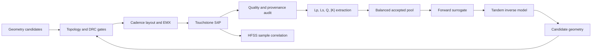

# RFIC Transformer AI Inverse Design

Research-grade Python tooling for parameterized RFIC transformer layout,
Cadence EMX data generation, Touchstone quality control, physical-feature
learning, inverse design, and EMX/HFSS cross-solver validation.

The inverse-design tooling maps desired `[Lp, Ls, Q, |K|]` values to ten
geometry variables. The currently authorized campaign targets exactly 200,000
unique accepted fresh real-EMX geometries, with four-port S4P outputs at
5-60 GHz, 1 GHz spacing and 56 points. NN training is not authorized in this
data-generation campaign; earlier million-sample and model-training protocols
are historical workflows, not its current execution contract.

> This repository contains code, synthetic examples, templates, and tests. It
> intentionally excludes foundry PDK files, licenses, credentials, real
> Touchstone datasets, model weights, tapeout layouts, and site-specific paths.
>
> **Visibility:** this sanitized research handoff is intentionally public so
> external GPT/research tools can read it. The repository owner authorized the
> public release on 2026-08-23.

## Start Here: Current Goals And Status

Start with [Current Evidence Status](docs/research/CURRENT_STATUS.md) and the
[timestamped Broadband56 production snapshot](docs/research/BROADBAND56_PUBLIC_PROGRESS_20260905T003832Z.json).
At the published observation, 31 accepted geometries and 1,736 frequency rows
were independently verified; the sole supervisor was waiting for hard resource
gates. This is not a live counter or a completed 200K dataset.

The earlier Monday-report goals, model-comparison results and blocked claims
are preserved in the
[historical Chinese engineering handoff](docs/research/ENGINEERING_HANDOFF_20260823_CN.md).
The architecture-matched engineering diagnostic completed at
`2026-08-24T03:45:26Z`; see the
[deployed-100k exact-contract on historical-200k status](docs/research/DEPLOYED100K_EXACT_CONTRACT_ON_200K_STATUS_20260824.json)
and its [strict completion blocker](docs/research/DEPLOYED100K_EXACT_CONTRACT_ON_200K_STRICT_BLOCKER_20260824.json)
and [100k reference-selection identity audit](docs/research/REFERENCE_100K_SELECTION_UNPROVEN.json).
Its strict literal-contract completion remains blocked: the frozen trainer
refits normalization, empirical geometry envelopes, and dimension weights from
the selected population and exposes no native reference-array input.
The broader machine-readable handoff state is available in
[HANDOFF_STATE_20260823.json](docs/research/HANDOFF_STATE_20260823.json).
The newest incremental, GPT-readable Monday-report snapshot is
[Monday Advisor Goal v1](research_snapshot/20260823/monday_advisor_goal_v1/README.md);
its exact status and public-sanitized review-code boundary are summarized in
[MONDAY_ADVISOR_SYNC_STATUS_20260823_CN.md](docs/research/MONDAY_ADVISOR_SYNC_STATUS_20260823_CN.md).

## Documentation

| Area | Entry point |
|---|---|
| Current authorized 200K data generation | [Current evidence status](docs/research/CURRENT_STATUS.md) |
| Verified production counts and evidence identities | [Broadband56 public progress snapshot](docs/research/BROADBAND56_PUBLIC_PROGRESS_20260905T003832Z.json) |
| Historical goals and Chinese research handoff | [历史目标与科研工程交接](docs/research/ENGINEERING_HANDOFF_20260823_CN.md) |
| Architecture-matched 200k engineering-run status | [Terminal status, proxy metrics, and evidence JSON](docs/research/DEPLOYED100K_EXACT_CONTRACT_ON_200K_STATUS_20260824.json) |
| Strict exact-contract completion blocker | [Frozen-trainer and array-identity blocker JSON](docs/research/DEPLOYED100K_EXACT_CONTRACT_ON_200K_STRICT_BLOCKER_20260824.json) |
| Deployed/presented 100k selection identity | [Reference identity audit](docs/research/REFERENCE_100K_SELECTION_UNPROVEN.json) |
| Machine-readable handoff state | [Handoff JSON](docs/research/HANDOFF_STATE_20260823.json) |
| Latest Monday-report code/status snapshot | [Monday Advisor Goal v1](research_snapshot/20260823/monday_advisor_goal_v1/README.md) |
| Latest GitHub sync status | [周一汇报同步状态](docs/research/MONDAY_ADVISOR_SYNC_STATUS_20260823_CN.md) |
| Known failed gates | [NO-GO register](docs/research/KNOWN_NO_GO_20260823.md) |
| Useful-code map | [Code map](docs/research/CODE_MAP_20260823.md) |
| Snapshot integrity | [Repository SHA-256 manifest](CODE_SNAPSHOT_SHA256.txt) |
| Release assembly and validation trace | [2026-08-23 release notes](docs/research/REPOSITORY_RELEASE_NOTES_20260823.md) |
| Machine-readable validation receipt | [Validation JSON](docs/research/REPOSITORY_VALIDATION_20260823.json) |
| Repository map | [Documentation index](docs/INDEX.md) |
| System components | [System overview](docs/architecture/SYSTEM_OVERVIEW.md) |
| End-to-end workflow | [Pipeline guide](docs/workflows/END_TO_END_PIPELINE.md) |
| Historical million-sample campaign | [Campaign protocol](docs/workflows/MILLION_DATA_CAMPAIGN.md) |
| Historical 100k model checkpoint tests | [Checkpoint protocol](docs/workflows/CHECKPOINT_MODEL_TESTS.md) |
| EMX/HFSS validation | [Cross-solver validation](docs/workflows/EMX_HFSS_VALIDATION.md) |
| Three-input MLP Q sweep and MARS GUI | [Exact-Q synthesis application](docs/workflows/MLP_Q_SWEEP_GUI.md) |
| Neural-network models | [Model catalog](docs/models/MODEL_CATALOG.md) |
| Research roadmap | [Literature-driven roadmap](docs/research/LITERATURE_ROADMAP.md) |
| Every command-line script | [Script catalog](docs/SCRIPT_CATALOG.md) |
| Public-release rules | [Security policy](docs/security/PUBLIC_RELEASE_POLICY.md) |

## Architecture



## Repository Layout

```text
rfic_transformer_inverse_design/  reusable Python package
scripts/                          auditable command-line workflows
tests/                            unit, contract, and fail-closed tests
configs/                          portable configuration templates
workflows/                        scheduler and cluster examples
site_ops/                         sanitized historical site-operation wrappers
tools/                            release and documentation utilities
docs/                             architecture, workflow, and research guides
.github/workflows/                continuous integration
```

Generated datasets and run artifacts belong outside the repository. All major
tools accept explicit input and output paths and write machine-readable JSON
summaries with source hashes.

## Installation

Python 3.10 or newer is required.

```bash
python -m venv .venv
source .venv/bin/activate
python -m pip install -e ".[test]"
python -m pytest -q
```

Optional dependencies:

```bash
python -m pip install -e ".[gui]"  # Qt and 3-D stackup viewer
python -m pip install -e ".[opt]"  # CMA-ES, BoTorch, and PyTorch
```

## Main Contracts

- **Physical targets:** `Lp`, `Ls`, scalar `Q=min(Qp,Qs)`, and `|K|`.
- **Default declared ranges:** `Lp/Ls=0.5-3.0 nH`, `Q=5-25`, `|K|=0-0.8`.
- **Reference sweep:** `5-60 GHz`, `0.5 GHz` spacing, 111 points.
- **Data labels:** accepted labels must come from parseable real EM Touchstone
  files; surrogate predictions may rank candidates but never become labels.
- **Checkpoint cadence:** exact cumulative prefixes at 100k through 1M.
- **Evaluation isolation:** training cells update weights, validation cells
  select checkpoints, and fixed held-out physical cells are evaluated once.
- **Final validation:** geometry audit, foundry DRC, fresh EMX, and sampled HFSS
  correlation remain required after neural-network prediction.

## Representative Commands

Audit a physical-feature table:

```bash
python scripts/audit_physical_feature_uniformity.py \
  --training-csv /path/to/training.csv \
  --out-dir /path/to/uniformity_audit \
  --require-explicit-ranges --require-four-d-gate --require-plots
```

Train the frozen-forward tandem model:

```bash
python scripts/train_physical_feature_tandem_inverse.py \
  --training-csv /path/to/training.csv \
  --out-dir /path/to/tandem \
  --split-mode physical_cell_grouped \
  --physical-cell-lower 0.5,0.5,5,0 \
  --physical-cell-upper 3,3,25,0.8 \
  --response-loss-scaling declared_range
```

Train the one-to-many multi-head research baseline:

```bash
python scripts/train_physical_feature_multihead_tandem_inverse.py \
  --training-csv /path/to/training.csv \
  --out-dir /path/to/multihead \
  --head-count 4
```

Run the three-input frozen-MLP Q sweep (`Lp`, `Ls`, and `|K|`; exact
`Q=10..20`):

```bash
rfic-transformer-q-sweep \
  --model-dir /private/path/to/hash-bound-model \
  --out-dir /new/no-clobber/run \
  --design-id demo_001 \
  --lp-nh 1.15 --ls-nh 1.40 --k-abs 0.76
```

The default command reports proxy diagnostics only. Selecting the final GDS by
physical error requires the private MARS backend to run fresh EMX for all eleven
Q candidates; see the workflow documentation above.

## Scientific Status

The code distinguishes execution success from scientific acceptance. A green
script run does not prove model quality, data uniformity, or simulator
equivalence. See [current status](docs/research/CURRENT_STATUS.md) for the
verified evidence and unresolved gates represented by this snapshot.

As of 2026-08-23, historical-model evidence, the frozen 10,000-target proxy
comparison, and 7,298 fresh-EMX survivor runs are available. The controlled
nested 100k/200k experiment is still running, while formal EMX statistics and
figures remain blocked by an independently confirmed reporting-interface
NO-GO. A separate architecture-matched historical-population engineering
diagnostic completed on the fixed legacy 8,000-target panel, but its deployed
100k reference is not the historical final winner and its scores are
own-forward-proxy metrics rather than physical accuracy. A strict completion
audit also found that the numerical normalization/envelope fields do not match
the 100k reference, so this result cannot satisfy a literal only-population-
changed contract without a project-leader decision. Do not interpret the
repository as a finalized Monday report.

## Attribution

This research code extends the MIT-licensed
[`henryczup/rfic-transformer-inverse-design`](https://github.com/henryczup/rfic-transformer-inverse-design)
toolbox. See [NOTICE.md](NOTICE.md) and [LICENSE](LICENSE).

## Publishing

Public release was approved by the repository owner on 2026-08-23 so external
GPT/research tools can read this sanitized handoff. See
[docs/PUBLISHING.md](docs/PUBLISHING.md) for the reviewed publication scope and
push procedure.
