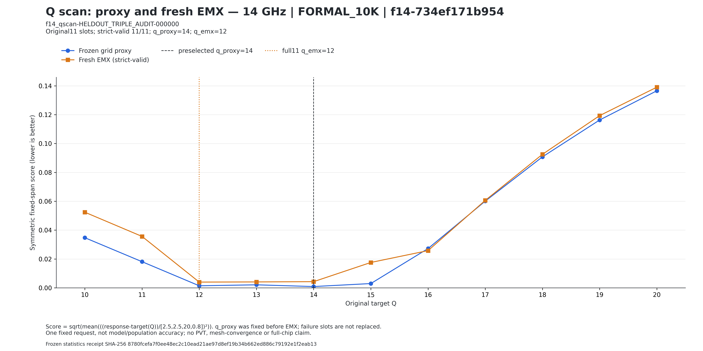
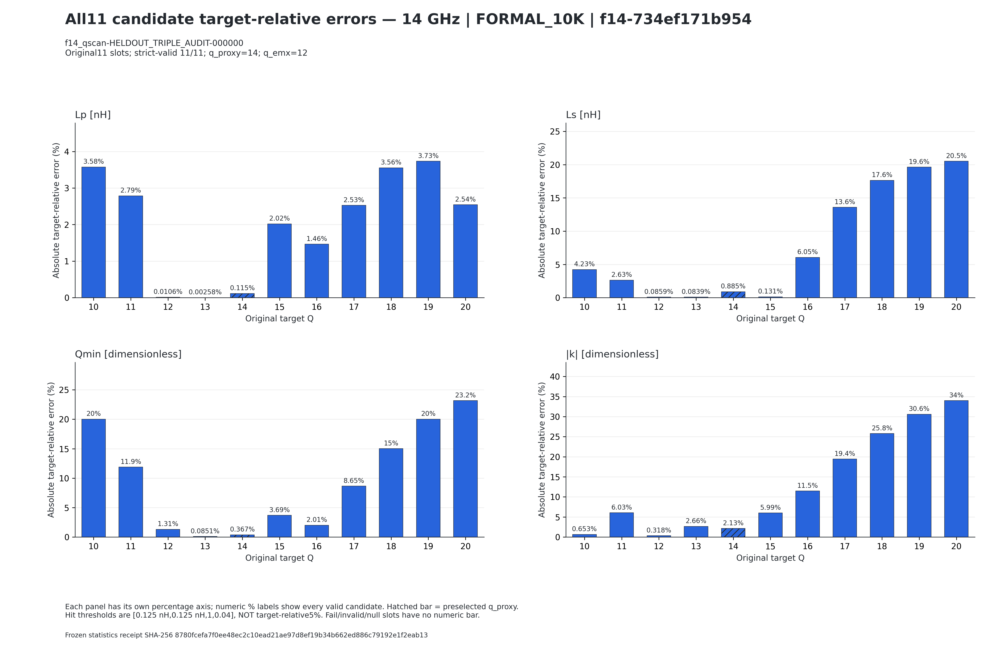

# 14 GHz formal10K：首个完整11候选的实际EMX个案

数据时点：2026-09-08 10:20:53.967268 UTC（冻结 snapshot_0004），不是实时队列状态。模型为 `f14-734ef171b954`；source-table为10,000个几何，14 GHz严格有效梯度训练／验证／测试行分别为4,107／1,341／1,376。

**仅R=1个固定heldout请求，CI不可估计。** 原Q10..20共11个候选全部严格有效，有11份不同候选的EMX求解收据和S4P SHA；这不是11个统计独立请求。

求解前冻结的 `q_proxy=14`，完整11候选后的回顾性 `q_emx=12`。固定Q15、q_proxy14、q_emx12的实际评分依次为0.017568283468822398、0.004275138853386978、0.003970675384321135；selection loss为0.00030446346906584307。

评分为 `sqrt(mean(((actual-target(Q))/[2.5,2.5,20,0.8])²))`，**score不是百分比**。精确同分取较小Q；本例最小值唯一。三个策略均为joint hit，原11候选共有5个joint hit。命中门限为固定绝对容差[0.125 nH, 0.125 nH, 1, 0.04]，不是相对目标的5%。

## 同一完整请求的精确绝对误差

| 策略 | Q | Lp（nH） | Ls（nH） | Qmin（无量纲） | 绝对耦合系数（无量纲） |
|---|---:|---:|---:|---:|---:|
| 固定Q15 | 15 | 0.02892735553221648 | 0.0017986488048369331 | 0.5528261159937458 | 0.014667127307643663 |
| 求解前q_proxy | 14 | 0.001641672510343195 | 0.012119386775284902 | 0.051355719598355165 | 0.005220377556544614 |
| 完整11候选后q_emx | 12 | 0.00015192110946715687 | 0.0011767308643630958 | 0.15733937303759937 | 0.0007799947375615734 |

R=1时MAE就是该单例的绝对误差。q_emx12仅为本请求原11候选的冻结评分最小点；不保证每个单指标最小，也不是总体“物理冠军”、总体准确率或泛化优越性的证据。不能推断PVT、网格收敛或全芯片签核。

## 已通过视觉QA的两张原图

两图原件由snapshot_0003生成，并被snapshot_0004逐SHA复用；本发布包仅复制既有PNG，没有重画。图片脚注保留原生成统计快照的SHA；该请求的源行与snapshot_0004完全一致。

第二张图是相对目标百分比诊断，不是score或命中容差。**selection aggregate严格visual NO-GO，不得作为已验收正式图使用，因此不纳入本公开目录。** 该图的Lp小正值标记被零轴裁切，且图上未显式写CI不可估计。当前结果使用本精确共同集表与上述已通过图交付。

## 来源与发布范围

数值核验与原图视觉QA直接复用已封存收据；本次仅整理发布包，不重复QA、推理、提取或EMX。CSV保留全部原字段及数值字符串，仅将换行CRLF规范为LF；JSON仅改为项目相对来源身份并补充发布说明。

- [精确CSV](EXACT_COMMON_SELECTION_TABLE.csv)
- [脱敏JSON及来源SHA](EXACT_COMMON_SELECTION_TABLE.json)
- [公开收据](PUBLIC_RECEIPT.json)
- [完整文件SHA索引](SHA256SUMS)

仅发布相对项目来源路径及SHA，不分发私有原始求解链、绝对机器路径或凭据。原始完整证据仍由工作区私有报告保留。
