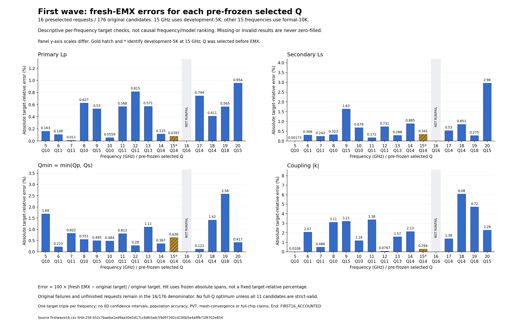
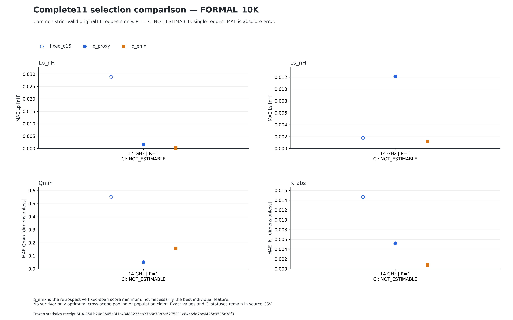

# 5–20 GHz 首轮16请求：真实物理验证与图表

冻结数据时点：2026-09-08T10:49:05.173141UTC（snapshot_0007）。
这是每条路线的第一个固定请求，不是每频20个请求全部完成，也不是随机10000请求的EMX验证。

## 本轮结果

- 16请求 / 176原始Q候选已accounted；140次实际独立求解。
- 135项严格有效，5项虽完成求解但未通过严格有效门；另8解析失败、16GDS失败、12Calibre失败。
- 原分母：176 = 135严格有效 + 5严格无效 + 8解析失败 + 16GDS失败 + 12Calibre失败。
- 求解前预选的q_proxy中，15个请求有严格有效实测；16GHz预选Q16在GDS阶段失败，未用其他Q替代它。
- 完整11项全部严格有效的请求仅14GHz一个；其他请求q_emx不可用，不从幸存子集选“冠军”。
- 18GHz的Q10/Q11原提取记录为descriptor有效但below_half_srf=false，不能当作严格集总标签；生产提取规则没有改变。
- 每频只有一个固定请求，CI不可估计；这些是描述性工程个案，不是总体准确率或跨频率因果排名。

## 模型与测试范围

正式10K是10000个唯一几何的源快照，不是每频10000训练行。所有频率共用几何hash划分，normalizer只用各自有效train。
16个256×3 Tandem模型均完成首预算、保存、独立重载、诊断单步续训、留出测试与训练/代理出图；全部PROVISIONAL/PARTIAL，不能声称充分收敛。
每频10000组三目标×11Q的代理压力测试已完成，共1760000逻辑候选；不重跑。

| GHz | 原始候选 | 实际求解 | 严格有效 | 严格无效 | 完整11门 |
|---|---:|---:|---:|---:|---|
| 5 | 11 | 8 | 8 | 0 | 未通过 |
| 6 | 11 | 8 | 8 | 0 | 未通过 |
| 7 | 11 | 7 | 7 | 0 | 未通过 |
| 8 | 11 | 9 | 9 | 0 | 未通过 |
| 9 | 11 | 8 | 8 | 0 | 未通过 |
| 10 | 11 | 9 | 9 | 0 | 未通过 |
| 11 | 11 | 9 | 9 | 0 | 未通过 |
| 12 | 11 | 10 | 10 | 0 | 未通过 |
| 13 | 11 | 9 | 9 | 0 | 未通过 |
| 14 | 11 | 11 | 11 | 0 | 通过 |
| 15* | 11 | 9 | 9 | 0 | 未通过 |
| 16 | 11 | 8 | 8 | 0 | 未通过 |
| 17 | 11 | 6 | 6 | 0 | 未通过 |
| 18 | 11 | 10 | 8 | 2 | 未通过 |
| 19 | 11 | 9 | 6 | 3 | 未通过 |
| 20 | 11 | 10 | 10 | 0 | 未通过 |

*15GHz物理路线为冻结开发5K；正式10K15模型虽已训练，但其fresh EMX仍NOT_RUN。实际source/train/val/test、模型身份和阶段状态见STATUS16.json，不能合并两个模型。

## 可直接用于汇报的实际图



柱图相对误差为100×绝对实测残差/原目标；命中仍用固定绝对容差[0.125nH,0.125nH,1,0.04]，不是目标相对5%。灰色不是零误差。



上图仅修复原选择汇总图的近零标记裁切与CI说明；原数字不变。12个MAE与批准CSV/SVG落点独立核对通过，原图FAIL保留。GO仅限此新版图及独立命令，运行中的消费者未升级。
[14GHz精确三策略表及原Q图](../frequency14_first_complete11_20260908_v1/README_CN.md)保持原冻结身份。q_proxy14、q_emx12；后者仅为本请求原11项固定跨度评分最小点，不保证每个指标误差更小。

19GHz原11槽评分和百分比图：[评分图](f19_proxy_emx_score_by_q.png)、[百分比图](f19_target_percent_by_q.png)。均通过实际PNG/PDF视觉验收，严格无效和GDS失败槽保留。

16/17GHz原评分图的遮挡和圆点裁切也已在独立v2修复：[16GHz](f16_proxy_emx_score_by_q_v2.png)、[17GHz](f17_proxy_emx_score_by_q_v2.png)。两张新PNG/PDF经根任务独立验收通过，原数值/线数据未变；旧图NO-GO保留，原百分比图无需重画，运行消费者没有热升级。

## 运行与复现

首16收集器于10:47:43UTC完成后自然退出；现有统计消费者于10:49:03UTC自动取得交接lease并接手其余304请求，不重收首16、不派发物理。
10:58:44UTC直接核验原MARS2146776仍活，处于5GHz第二请求EMX阶段。数据表保持上述首16冻结快照，不冒充实时总数。
仍按全局最多4研究EMX×CPU2、Cadence1/Calibre1；18:00UTC停止新派发，18:15UTC收集截止，不kill健康求解器。尚未达到每频20请求，不能保证余下物理工作在本轮预算内完成。
生产、GUI、冻结模型、目标、标签规则及原始数据均未修改。

独立修正版图命令（已用实际冻结快照执行；PRIVATE路径由操作者提供，输出必须全新）：

```sh
python -B -m research.broadband56_nn.frequency_physical_selection_figures_v2 --stats /PRIVATE/PUBLISHED_STATISTICS --out /PRIVATE/NEW_SELECTION_FIGURES
```

[原生可编辑PPT及PDF](../frequency5to20_advisor_20260908_v1/README.md)仍冻结首6物理请求；本目录是首16实测补充，不静默替换旧报告。精确CSV、来源SHA、QA范围及发布收据随目录保存。
