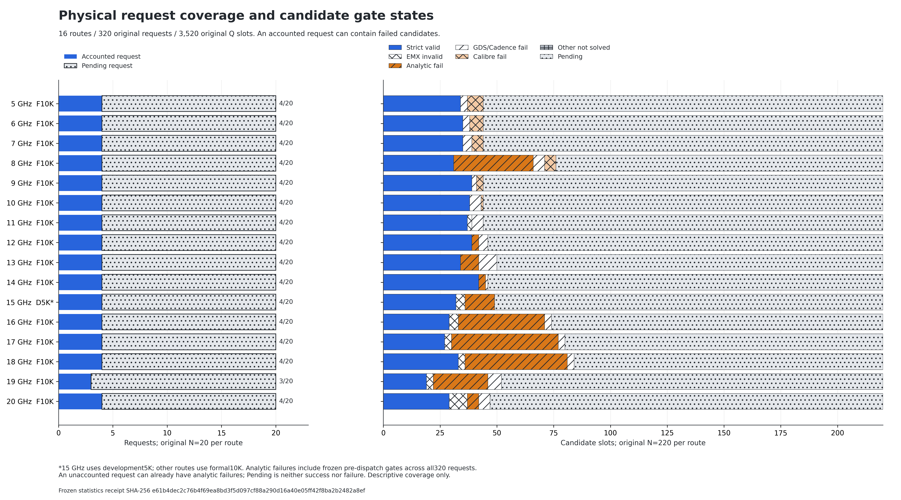
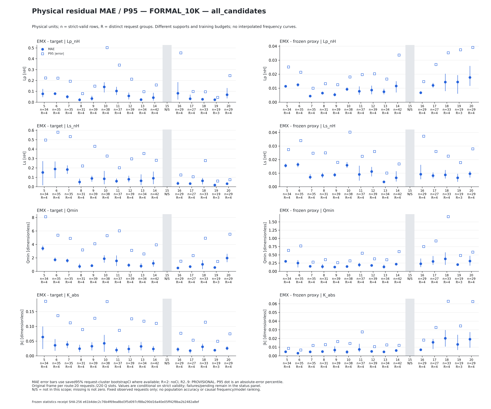
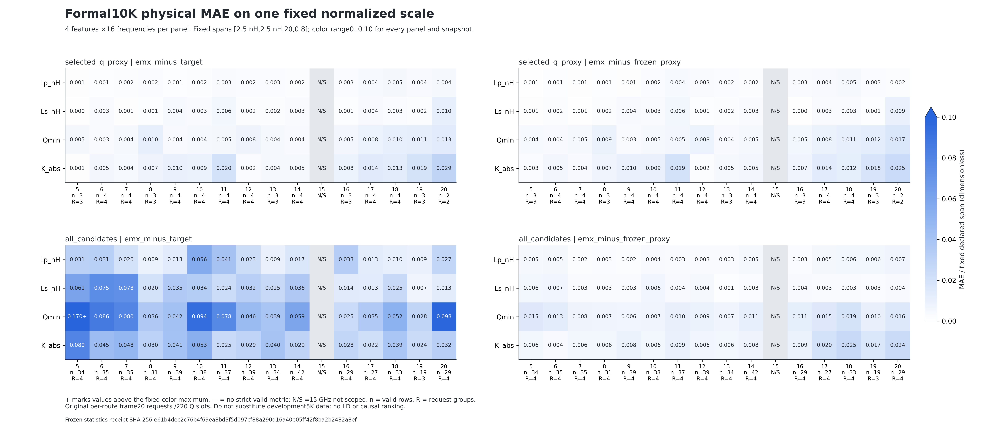
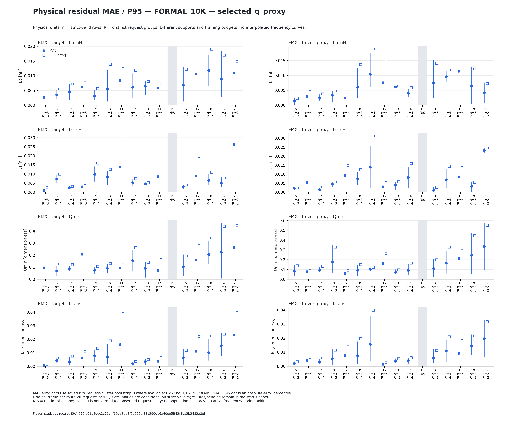
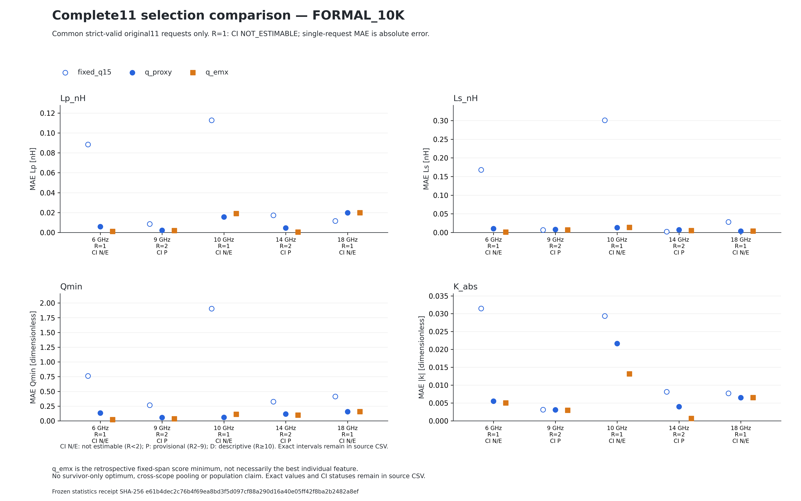

# 5–20 GHz：新增23请求，累计63请求物理结果

冻结snapshot_0054，时间2026-09-08 17:11:58 UTC。这里只报告该快照，后台更晚进度不混入数值。原40请求未重新生成、训练、推理或求解。

## 技术摘要

累计63请求完成结算，但只有7请求的11个Q候选全部strict有效。560次真实求解中533个strict有效；制造门禁失败和27个提取后strict无效仍保留。当前能说明冻结请求中的代理与物理偏差及失败位置，不能说明随机目标总体准确率或16频率模型已充分收敛。

## 结果与分母

| 范围 | 原候选槽 | 独立求解 | strict有效 | strict无效 | 几何解析拒绝 | GDS失败 | DRC失败 | pending |
|---|---:|---:|---:|---:|---:|---:|---:|---:|
| 新23已结算 | 253 | 207 | 194 | 13 | 20 | 20 | 6 | 0 |
| 累计63已结算 | 693 | 560 | 533 | 27 | 46 | 60 | 27 | 0 |
| 原320全部计划 | 3520 | 560 | 533 | 27 | 221 | 60 | 27 | 2652 |

63/320请求已结算，257请求未结算。全计划221个已知解析拒绝中，只有46个属于已结算请求。2652 pending属于尚未结算部分。独立求解数记录实际不同求解工件，不是统计独立样本数。

新增23请求中，21个预选候选strict有效并满足四项绝对联合容差，另1个预选GDS失败、1个strict无效。该描述包含22个正式10K请求和1个开发5K请求，仅为操作计数，不能用21/23作为模型总体准确率或跨版本合并排名。

## 16频率训练与测试

[STATUS16.csv](STATUS16.csv)和[STATUS16.json](STATUS16.json)给出正式快照、有效train/val/test、更新、模型/权重/包身份、加载及诊断续训证据、测试、物理和出图分列状态。全部首预算模型仍PARTIAL/PROVISIONAL。每频10000组三指标乘11个Q的SELF_PROXY已完成，共1760000逻辑候选，本次未重算。

STATUS16是数值审查时的冻结候选，保留当时的PENDING_EXACT_QA和历史图字段，不静默改写。较晚的本轮逐频图表发布状态见[FIGURE_RELEASE_STATUS.json](FIGURE_RELEASE_STATUS.json)，只批准精确列出的图，不批准未来快照。

5–16 GHz正反向各12000更新，17/18/19/20 GHz分别8875/5538/3357/1744。19/20 GHz有效train仅537/279，更新上限早于反向反馈ramp完整结束。已有test/EMX不能回灌选择本轮冻结权重。

物理15 GHz为开发5K模型f15-5a9547401a37，累计4请求/36求解/32strict有效。正式10K15模型f15-strict_lumped-f5f2ced054ef的fresh EMX仍NOT_RUN。表中这两种模型的训练和物理字段分别标注，不合并。

## 新增请求逐项状态

请求顺序固定为原dispatch_order 40..62，来源HELDOUT_TRIPLE_AUDIT，未按结果挑选。三指标来自留出几何也不保证11个Q均可实现。

| GHz | 第几请求 | 模型数据 | q_proxy | q_emx | 求解 | strict | 无效 | 解析拒绝 | GDS失败 | DRC失败 |
|---|---:|---|---:|---:|---:|---:|---:|---:|---:|---:|
| 11 | 3 | 正式10K | 12 | n.a. | 11 | 10 | 1 | 0 | 0 | 0 |
| 12 | 3 | 正式10K | 14 | n.a. | 10 | 10 | 0 | 0 | 1 | 0 |
| 13 | 3 | 正式10K | 16 | n.a. | 9 | 9 | 0 | 1 | 1 | 0 |
| 14 | 3 | 正式10K | 12 | n.a. | 10 | 10 | 0 | 0 | 1 | 0 |
| 16 | 3 | 正式10K | 11 | n.a. | 7 | 4 | 3 | 3 | 1 | 0 |
| 17 | 3 | 正式10K | 15 | n.a. | 9 | 8 | 1 | 2 | 0 | 0 |
| 18 | 3 | 正式10K | 15 | n.a. | 8 | 8 | 0 | 2 | 1 | 0 |
| 19 | 3 | 正式10K | 15 | n.a. | 6 | 6 | 0 | 2 | 3 | 0 |
| 15 | 4 | 开发5K | 12 | n.a. | 11 | 10 | 1 | 0 | 0 | 0 |
| 5 | 4 | 正式10K | 11 | n.a. | 6 | 6 | 0 | 0 | 2 | 3 |
| 10 | 4 | 正式10K | 12 | 11 | 11 | 11 | 0 | 0 | 0 | 0 |
| 20 | 4 | 正式10K | 14 | n.a. | 9 | 4 | 5 | 2 | 0 | 0 |
| 6 | 4 | 正式10K | 10 | 12 | 11 | 11 | 0 | 0 | 0 | 0 |
| 7 | 4 | 正式10K | 11 | n.a. | 9 | 9 | 0 | 0 | 0 | 2 |
| 8 | 4 | 正式10K | 14 | n.a. | 5 | 5 | 0 | 3 | 3 | 0 |
| 9 | 4 | 正式10K | 10 | n.a. | 9 | 9 | 0 | 0 | 1 | 1 |
| 11 | 4 | 正式10K | 11 | n.a. | 10 | 10 | 0 | 0 | 1 | 0 |
| 12 | 4 | 正式10K | 14 | n.a. | 9 | 9 | 0 | 1 | 1 | 0 |
| 13 | 4 | 正式10K | 15 | n.a. | 9 | 9 | 0 | 1 | 1 | 0 |
| 14 | 4 | 正式10K | 15 | n.a. | 10 | 10 | 0 | 1 | 0 | 0 |
| 16 | 4 | 正式10K | 16 | n.a. | 11 | 10 | 1 | 0 | 0 | 0 |
| 17 | 4 | 正式10K | 13 | n.a. | 10 | 10 | 0 | 0 | 1 | 0 |
| 18 | 4 | 正式10K | 13 | n.a. | 7 | 6 | 1 | 2 | 2 | 0 |

## 预选候选目标相对百分比误差

以下百分比为abs(EMX-target)/abs(target)乘100，仅作诊断。联合命中使用绝对容差[0.125 nH,0.125 nH,1,0.04]，不是相对5%。strict无效的有限descriptor值仍保留，但不进入strict主误差。失败缺失保持n.a.。

### 正式10K模型

| GHz | 第几请求 | q_proxy | Lp (%) | Ls (%) | Q_scalar (%) | abs(k) (%) | 阶段 | 联合判定 |
|---|---:|---:|---:|---:|---:|---:|---|---|
| 11 | 3 | 12 | 0.260 | 1.188 | 0.531 | 2.189 | SOLVED_STRICT_VALID | HIT |
| 12 | 3 | 14 | 0.098 | 0.381 | 1.193 | 1.412 | SOLVED_STRICT_VALID | HIT |
| 13 | 3 | 16 | 0.333 | 0.495 | 0.690 | 2.257 | SOLVED_STRICT_VALID | HIT |
| 14 | 3 | 12 | 0.533 | 0.825 | 0.088 | 0.240 | SOLVED_STRICT_VALID | HIT |
| 16 | 3 | 11 | 0.328 | 0.377 | 0.230 | 0.648 | SOLVED_STRICT_VALID | HIT |
| 17 | 3 | 15 | 1.697 | 1.845 | 1.254 | 5.034 | SOLVED_STRICT_VALID | HIT |
| 18 | 3 | 15 | 1.629 | 0.710 | 2.447 | 6.721 | SOLVED_STRICT_VALID | HIT |
| 19 | 3 | 15 | 0.241 | 0.401 | 0.047 | 11.910 | SOLVED_STRICT_VALID | HIT |
| 5 | 4 | 11 | n.a. | n.a. | n.a. | n.a. | GDS_FAIL | 不纳入strict误差 |
| 10 | 4 | 12 | 0.925 | 0.652 | 0.500 | 5.745 | SOLVED_STRICT_VALID | HIT |
| 20 | 4 | 14 | 2.504 | 2.522 | 2.696 | 15.461 | SOLVED_INVALID | 不纳入strict误差 |
| 6 | 4 | 10 | 0.496 | 0.873 | 1.328 | 3.119 | SOLVED_STRICT_VALID | HIT |
| 7 | 4 | 11 | 0.406 | 0.200 | 0.579 | 4.129 | SOLVED_STRICT_VALID | HIT |
| 8 | 4 | 14 | 1.394 | 0.128 | 1.427 | 1.990 | SOLVED_STRICT_VALID | HIT |
| 9 | 4 | 10 | 0.215 | 0.479 | 1.117 | 3.703 | SOLVED_STRICT_VALID | HIT |
| 11 | 4 | 11 | 0.454 | 0.460 | 0.910 | 2.892 | SOLVED_STRICT_VALID | HIT |
| 12 | 4 | 14 | 0.465 | 0.218 | 1.983 | 1.638 | SOLVED_STRICT_VALID | HIT |
| 13 | 4 | 15 | 0.860 | 0.302 | 0.094 | 0.538 | SOLVED_STRICT_VALID | HIT |
| 14 | 4 | 15 | 0.741 | 0.372 | 0.345 | 1.884 | SOLVED_STRICT_VALID | HIT |
| 16 | 4 | 16 | 0.137 | 0.303 | 1.284 | 5.603 | SOLVED_STRICT_VALID | HIT |
| 17 | 4 | 13 | 0.355 | 0.217 | 2.251 | 7.753 | SOLVED_STRICT_VALID | HIT |
| 18 | 4 | 13 | 0.651 | 0.551 | 0.771 | 2.208 | SOLVED_STRICT_VALID | HIT |

### 开发5K15 GHz，独立展示

| GHz | 第几请求 | q_proxy | Lp (%) | Ls (%) | Q_scalar (%) | abs(k) (%) | 阶段 | 联合判定 |
|---|---:|---:|---:|---:|---:|---:|---|---|
| 15 | 4 | 12 | 0.395 | 0.657 | 1.319 | 3.758 | SOLVED_STRICT_VALID | HIT |

完整target、EMX、frozen-grid-proxy、带符号残差和百分比见[NEW23_SELECTED_PHYSICS.csv](NEW23_SELECTED_PHYSICS.csv)。

5 GHz第4请求预选Q11停在GDS_FAIL，没有EMX误差，不能填0。20 GHz第4请求预选Q14为SOLVED_INVALID，即使Q百分比误差约2.696%，仍不能称合格strict物理实现。19 GHz第3请求的abs(k)相对误差约11.910%但绝对容差HIT，说明百分比诊断与本次成功定义不同。

原门禁证据：5 GHz该候选的解析检查通过，但GDS审计的ground_clearance_pass、foundry_power_line_contract_pass、foundry_via_stack_and_landing_pad_pass失败，calibre_eligible=false。这里只指出原失败门，不推断更细工艺根因。20 GHz该候选descriptor_valid和physics_qa_pass为true，strict_lumped_valid和below_half_srf为false，主副SRF原括区均为39–40 GHz。有限描述值不能替代strict有效性。对应原旗标文件SHA为4fa7a53ae17c70343b7d63877dd980d6e57988070c26c1013daecd86ed0bdde7。

## 完整11项选择比较

累计7请求原11候选全部strict有效，只有这些请求允许完整q_emx。新增为10 GHz第4请求(q_proxy12,q_emx11,selection loss0.004360431653541623)及6 GHz第4请求(10,12,0.002146481596066446)。其他请求q_emx保持不可用。

评分sqrt(mean(((observed-target(q))/[2.5,2.5,20,0.8])^2))，低分优先，同分取低Q。q_proxy在EMX前冻结。固定q15、q_proxy和q_emx只在共同完整候选集上比较，见[SELECTION_COMPARISON.csv](SELECTION_COMPARISON.csv)。

## 误差表和统计区间

[METRICS.csv](METRICS.csv)逐频、逐目标、分误差角色保存MAE/RMSE/Bias/P50/P90/P95。EMX-target与EMX-frozen-proxy分开，预选与全部候选分开，strict与finite diagnostic分开，开发5K与正式10K分开。

独立审查核对512个指标行、3072个标量误差以及192个selection行。95%区间使用整请求bootstrap，2000次，seed2026090801。每频只有3–4个已结算请求，区间均是小样本描述性证据。不能把同请求11个候选当11个独立样本或宣称总体精度/因果优胜。

## 本轮精确批准的图

仅列出有本轮精确视觉批准且SHA一致的图。对应PDF/SVG源路径和SHA在PUBLIC_RECEIPT.json。原自动图、显示失败及修复记录均保留，后台renderer没有热修改。

| GHz / 第几请求 | 图 |
|---|---|
| 11 / 3 | [score](f11_qscan-HELDOUT_TRIPLE_AUDIT-000002_score.png) / [percent](f11_qscan-HELDOUT_TRIPLE_AUDIT-000002_percent.png) |
| 12 / 3 | [score](f12_qscan-HELDOUT_TRIPLE_AUDIT-000002_score.png) / [percent](f12_qscan-HELDOUT_TRIPLE_AUDIT-000002_percent.png) |
| 13 / 3 | [score](f13_qscan-HELDOUT_TRIPLE_AUDIT-000002_score.png) / [percent](f13_qscan-HELDOUT_TRIPLE_AUDIT-000002_percent.png) |
| 14 / 3 | [score](f14_qscan-HELDOUT_TRIPLE_AUDIT-000002_score.png) / [percent](f14_qscan-HELDOUT_TRIPLE_AUDIT-000002_percent.png) |
| 16 / 3 | [score](f16_qscan-HELDOUT_TRIPLE_AUDIT-000002_score.png) / [percent](f16_qscan-HELDOUT_TRIPLE_AUDIT-000002_percent.png) |
| 17 / 3 | [score](f17_qscan-HELDOUT_TRIPLE_AUDIT-000002_score.png) / [percent](f17_qscan-HELDOUT_TRIPLE_AUDIT-000002_percent.png) |
| 18 / 3 | [score](f18_qscan-HELDOUT_TRIPLE_AUDIT-000002_score.png) / [percent](f18_qscan-HELDOUT_TRIPLE_AUDIT-000002_percent.png) |
| 19 / 3 | [score](f19_qscan-HELDOUT_TRIPLE_AUDIT-000002_score.png) / [percent](f19_qscan-HELDOUT_TRIPLE_AUDIT-000002_percent.png) |
| 15 / 4 | [score](qscan15_development5k_20260908_v1-HELDOUT_TRIPLE_AUDIT-000003_score.png) / [percent](qscan15_development5k_20260908_v1-HELDOUT_TRIPLE_AUDIT-000003_percent.png) |
| 5 / 4 | [score](f05_qscan-HELDOUT_TRIPLE_AUDIT-000003_score.png) / [percent](f05_qscan-HELDOUT_TRIPLE_AUDIT-000003_percent.png) |
| 10 / 4 | [score](f10_qscan-HELDOUT_TRIPLE_AUDIT-000003_score.png) / [percent](f10_qscan-HELDOUT_TRIPLE_AUDIT-000003_percent.png) |
| 20 / 4 | [score](f20_qscan-HELDOUT_TRIPLE_AUDIT-000003_score.png) / [percent](f20_qscan-HELDOUT_TRIPLE_AUDIT-000003_percent.png) |
| 6 / 4 | [score](f06_qscan-HELDOUT_TRIPLE_AUDIT-000003_score.png) / [percent](f06_qscan-HELDOUT_TRIPLE_AUDIT-000003_percent.png) |
| 7 / 4 | [score](f07_qscan-HELDOUT_TRIPLE_AUDIT-000003_score.png) / [percent](f07_qscan-HELDOUT_TRIPLE_AUDIT-000003_percent.png) |
| 8 / 4 | [score](f08_qscan-HELDOUT_TRIPLE_AUDIT-000003_score.png) / [percent](f08_qscan-HELDOUT_TRIPLE_AUDIT-000003_percent.png) |
| 9 / 4 | [score](f09_qscan-HELDOUT_TRIPLE_AUDIT-000003_score.png) / [percent](f09_qscan-HELDOUT_TRIPLE_AUDIT-000003_percent.png) |
| 11 / 4 | [score](f11_qscan-HELDOUT_TRIPLE_AUDIT-000003_score.png) / [percent](f11_qscan-HELDOUT_TRIPLE_AUDIT-000003_percent.png) |
| 12 / 4 | [score](f12_qscan-HELDOUT_TRIPLE_AUDIT-000003_score.png) / [percent](f12_qscan-HELDOUT_TRIPLE_AUDIT-000003_percent.png) |
| 13 / 4 | [score](f13_qscan-HELDOUT_TRIPLE_AUDIT-000003_score.png) / [percent](f13_qscan-HELDOUT_TRIPLE_AUDIT-000003_percent.png) |
| 14 / 4 | [score](f14_qscan-HELDOUT_TRIPLE_AUDIT-000003_score.png) / [percent](f14_qscan-HELDOUT_TRIPLE_AUDIT-000003_percent.png) |
| 16 / 4 | [score](f16_qscan-HELDOUT_TRIPLE_AUDIT-000003_score.png) / [percent](f16_qscan-HELDOUT_TRIPLE_AUDIT-000003_percent.png) |
| 17 / 4 | [score](f17_qscan-HELDOUT_TRIPLE_AUDIT-000003_score.png) / [percent](f17_qscan-HELDOUT_TRIPLE_AUDIT-000003_percent.png) |
| 18 / 4 | [score](f18_qscan-HELDOUT_TRIPLE_AUDIT-000003_score.png) / [percent](f18_qscan-HELDOUT_TRIPLE_AUDIT-000003_percent.png) |

### route_status

每条频率按原20请求/220候选计数，失败和pending保留。此图解释验证进度与损耗，不代表模型准确率；15 GHz开发5K独立标记。

### all_candidates

各频率strict有效候选的MAE/P95按四项物理单位分开显示；它是通过门禁的条件性误差，不能忽略上图中的失败或按不同样本量进行冠军排名。

### heatmap

固定跨度归一化误差用于查看量级分布，空缺正式15 GHz不插值。频率间标签支持与样本数不同，只作描述性对照。

### selected

只评价EMX前冻结的q_proxy对应候选，未按EMX结果重选成功样本。低误差标记完整显示；失败预选及strict无效候选在逐项表中保留，不填零。

### selection

只纳入7个完整strict11请求，比较冻结预选、固定Q15及事后全候选最优。每频完整请求很少，无法估计或暂定的区间明确标记，不能推广为总体选择性能。

## 调用和仍未完成的工作

[既有统一模型调用](../FREQUENCY_LIBRARY_USAGE_CN.md)及[已验收40请求导师PPT](../frequency5to20_advisor_cumulative40_20260908_v1/README_CN.md)继续保留。本次交付为静态增量图表与数据包，40请求PPT没有伪改为63。

原320物理队列及已安装的一次性续接程序继续负责执行。后续预算需原进程自然退出、终态和资源门满足后才生效。未重装等待器，不新增训练/求解，生产及GUI未修改。

剩余：原320请求完成与全部新结果验收。随机10000物理请求是另外未运行的框架，176万代理候选不能称真实EMX验证。Q20超出所有16路观察到的strict train边缘范围，可达性UNKNOWN。

## 证据

PUBLIC_RECEIPT.json保留源文件和公开副本双SHA、精确数值/状态/逐图QA引用。私有原始数据、模型权重、PDK与远端运行工件未包含；相对路径并不表示这些源已上传。

旧40结果和所有失败尝试保留。整体目标仍ACTIVE。
